# Tayzu system diagram

This is the single system diagram for the whole Tayzu product, as required by
SSA SEC01. It is maintained as docs-as-code (decision R6 of
`001-catalog-core`): every OpenSpec change that adds a component, an actor or a
network interaction updates it in the same pull request.

**Current state: `002-auth-and-rbac`.** Tayzu is a set of TypeScript
libraries, a PostgreSQL 16 schema and, since 002, the first application:
`apps/api`, a Fastify listener that serves the catalog API and Better Auth's
allowlisted routes, with Cerbos as the only authorization engine. The
catalog libraries are still also called in-process by tests. Nothing is
deployed yet: the Azure environment is `010`. The process entry point
(`apps/api/src/main.ts`) exists and starts the listener, and the CI DAST job
runs it against a throwaway database. The parts that exist in the repository are drawn solid, and
everything else is planned and drawn dashed, labeled with the change that
introduces it.

## Diagram

```mermaid
---
config:
  flowchart:
    wrappingWidth: 420
---
flowchart TB
    subgraph productActors["Product actors"]
        direction TB
        user(["End user (human)"])
        agent(["AI agent"])
        integ(["Integration<br/>GitHub, Jira Cloud, Azure DevOps, Aikido,<br/>Orca Security, Escape, CodeRabbit"])
    end

    subgraph delivery["Development and delivery (outside the product boundary)"]
        dev(["Developer<br/>humans and their Claude Code sessions"])
        ci(["CI: GitHub Actions CI<br/>.github/workflows/ci.yml<br/>lint · typecheck · test (postgres:16 service)<br/>contract:check · otel-smoke-check · pnpm audit · gitleaks"])
        dast(["CI: DAST job dast-zap<br/>scripts/ci/dast.sh, throwaway stack per run<br/>ZAP baseline (authenticated, seeded session)<br/>ZAP OpenAPI API scan (safe mode, passive)"])
        gh["GitHub repository<br/>nahuex/tayzu"]
        npm["npm registry"]
    end

    subgraph tayzu["Tayzu (product boundary)"]
        subgraph acaEnv["Azure Container Apps environment (010)"]
            subgraph apiApp["apps/api: Fastify listener (002, code exists; not deployed until 010)"]
                direction TB
                api["Fastify + oRPC API server<br/>onRequest allowlist · CORS · helmet · CSRF · body limit<br/>rate limits · resolveContext · error mapping<br/>Web UI (003)"]
                catalogApi["/v1 catalog API<br/>12 oRPC routes under /v1/blueprints"]
                healthApi["GET /healthz<br/>liveness only, unauthenticated"]
                authApi["Better Auth allowlisted routes<br/>/api/auth/* (deny by default)<br/>including public GET /api/auth/jwks"]
                tokenApi["POST /v1/auth/token<br/>machine credential exchange"]
                ssoApi["Visma Connect sign-in and callback<br/>/api/auth/sign-in/social<br/>/api/auth/callback/visma-connect<br/>/api/auth/link-social · /api/auth/unlink-account"]
                bclApi["Back-channel logout endpoint<br/>POST /v1/auth/visma-connect/backchannel-logout"]
                reauthApi["SSO step-up callback<br/>GET and POST /v1/auth/visma-connect/reauthorize/callback<br/>URL built on BETTER_AUTH_URL"]
            end
            authn["Better Auth (002)<br/>in-process library"]
            cerbos["Cerbos PDP sidecar (002)<br/>same ACA revision, loopback only<br/>no external arrow<br/>gRPC uses TLS on any other address"]
            mcp["MCP server (013)<br/>MCP endpoint"]
            workers["BullMQ workers (004)<br/>workflow engine, outbox consumer"]
            intg["Integration adapters (008/009)<br/>Integration webhook endpoints<br/>pollers (ACA Jobs), JSONata mapping"]
        end

        system(["System<br/>internal actor: Tayzu's own automation"])

        subgraph core["Catalog core (001): No network attack surface, in-process only"]
            catalog["@tayzu/catalog (library)<br/>domain · persistence · service pipeline<br/>oRPC router + OpenAPI contract (in-process only)"]
            db["@tayzu/db<br/>pg pool · tenant transaction (app.tenant_id)<br/>migration runner · migrations"]
            obs["@tayzu/observability<br/>OTel test harness (in-memory exporters)<br/>SDK bootstrap helper for host apps"]
            pg[("PostgreSQL 16<br/>catalog_blueprint · catalog_relation_definition<br/>catalog_entity · catalog_entity_relation<br/>catalog_change_event (append-only) · catalog_tenant_sequence<br/>001: ephemeral test databases only<br/>010: Azure Database for PostgreSQL Flexible Server")]
        end

        subgraph azure["Azure platform services (010)"]
            redis[("Redis (004)<br/>Azure Cache for Redis (010)")]
            monitor["Azure Monitor / Application Insights (010)<br/>centralized logging and telemetry"]
            acr["Azure Container Registry (010)"]
        end
    end

    subgraph external["Supporting systems (external)"]
        llm["LLM API: Anthropic Claude<br/>via DecisionProvider (004/006/014)"]
        toolApis["Integration tool APIs<br/>GitHub, Jira Cloud, Azure DevOps, Aikido, Escape"]
        visma(["Visma Connect (002)<br/>external OIDC identity provider<br/>connect.visma.com"])
        kv(["Azure Key Vault (002/010)<br/>external secret store<br/>feeds the deployment pipeline and the running container"])
    end

    subgraph legend["Legend"]
        direction TB
        lgCurrent["Current component (exists in the repository)"]
        lgPlanned["Planned component (change number)"]
        lgActor(["Actor"])
        lgStore[("Data store")]
        lgExternal["External supporting system"]
        lgCurrent -->|"current interaction: protocol"| lgStore
        lgPlanned -.->|"planned interaction: protocol"| lgExternal
    end

    %% Current interactions (001)
    dev -->|"HTTPS (git push, pull request)"| gh
    dev -->|"in-process call (local Vitest run)"| catalog
    ci -->|"HTTPS (job pickup on push and pull_request,<br/>git checkout)"| gh
    ci -->|"HTTPS (pnpm install, pnpm audit)"| npm
    ci -->|"in-process call (Vitest test run)"| catalog
    ci -->|"in-process call (pnpm db:migrate)"| db
    catalog -->|"in-process call"| db
    catalog -->|"in-process call (OTel API)"| obs
    db -->|"PostgreSQL wire protocol over TLS<br/>(sslmode=verify-full; test harness only:<br/>localhost without TLS)"| pg

    %% Current interactions (002)
    user -->|"HTTPS (browser, session cookie)"| catalogApi
    user -->|"HTTPS (browser, sign-in, session, MFA; anonymous JWKS read)"| authApi
    user -->|"HTTPS (anonymous liveness probe)"| healthApi
    user -->|"HTTPS (browser redirect to sign in and back)"| visma
    agent -->|"HTTPS (Bearer machine access token)"| catalogApi
    agent -->|"HTTPS (client id and secret)"| tokenApi
    ssoApi -->|"outbound HTTPS: discovery, authorize redirect,<br/>token, userinfo, JWKS"| visma
    visma -->|"inbound HTTPS: callback with code and state<br/>(response_mode form_post via the browser)"| ssoApi
    user -->|"HTTPS (browser redirect back from the step-up re-authorization)"| reauthApi
    visma -->|"inbound HTTPS: step-up callback with code and state<br/>(query or form_post via the browser)"| reauthApi
    reauthApi -->|"outbound HTTPS: one token exchange<br/>(5-second timeout)"| visma
    visma -->|"inbound-only HTTPS POST: logout_token<br/>(public, no cookie, unauthenticated by design)"| bclApi
    api -->|"in-process call (resolveContext, auth.handler)"| authn
    api -->|"gRPC (Cerbos PDP API): TLS except when the address is<br/>localhost, 127.0.0.1 or [::1] (sidecar, no TLS)"| cerbos
    authn -->|"in-process call (Drizzle adapter, role tayzu_auth)"| db
    api -->|"in-process call (oRPC OpenAPIHandler)"| catalog
    ci -->|"job pickup (dast-zap)"| dast
    dast -->|"HTTP on localhost (ZAP, seeded session cookie):<br/>/healthz, /v1 and /api/auth/*; safe mode for the API scan"| api
    dast -->|"PostgreSQL over verified TLS (per-run CA, sslmode=verify-full):<br/>owner migrates, apps/api runs as tayzu_app and tayzu_auth"| pg

    %% Planned interactions
    agent -.->|"MCP Streamable HTTP over HTTPS"| mcp
    integ -.->|"HTTPS (inbound webhooks)"| intg
    intg -.->|"HTTPS (API polling from ACA Jobs)"| toolApis
    mcp -.->|"in-process call (same oRPC procedures,<br/>Better Auth and Cerbos)"| api
    api -.->|"Redis protocol (RESP) over TLS"| redis
    workers -.->|"Redis protocol (RESP) over TLS"| redis
    workers -.->|"in-process call"| catalog
    workers -.->|"HTTPS"| llm
    intg -.->|"in-process call (status writes)"| catalog
    system -.->|"in-process call (actor type system)"| catalog
    obs -.->|"OTLP/HTTPS (OTel SDK exporter in the host apps;<br/>or the Azure Monitor exporter over HTTPS, chosen in 010)"| monitor
    acaEnv -.->|"HTTPS (secret references, managed identity,<br/>resolved into environment variables at container start)"| kv
    ci -.->|"HTTPS (deployment pipeline reads and rotates secret versions)"| kv
    acaEnv -.->|"HTTPS (image pull, managed identity)"| acr
    ci -.->|"HTTPS (image push)"| acr
    ci -.->|"HTTPS (Azure Resource Manager:<br/>az containerapp update)"| acaEnv
    dev -.->|"HTTPS (Azure portal / CLI, Entra ID)"| azure

    classDef current fill:#e8f1fb,stroke:#1f5f99,stroke-width:2px,color:#0b2540
    classDef planned fill:#f6f6f6,stroke:#777777,stroke-width:1.5px,stroke-dasharray:6 4,color:#333333
    classDef actor fill:#fff4e0,stroke:#b36b00,stroke-width:2px,color:#3d2400
    classDef externalSys fill:#ffffff,stroke:#555555,stroke-width:1px,color:#222222

    class catalog,db,obs,pg,api,catalogApi,healthApi,authApi,tokenApi,ssoApi,bclApi,reauthApi,authn,cerbos,lgCurrent,lgStore current
    class mcp,workers,intg,redis,monitor,acr,lgPlanned planned
    class user,agent,integ,visma,kv,dev,ci,dast,system,lgActor actor
    class gh,npm,llm,toolApis,lgExternal externalSys

    style tayzu fill:#fbfdff,stroke:#1f5f99,stroke-width:3px
    style acaEnv fill:#fafafa,stroke:#777777,stroke-dasharray:6 4
    style azure fill:#fafafa,stroke:#777777,stroke-dasharray:6 4
    style apiApp fill:#f3f8fd,stroke:#1f5f99,stroke-width:2px
    style core fill:#f3f8fd,stroke:#1f5f99
    style legend fill:#ffffff,stroke:#bbbbbb
```



## Legend

| Element                    | Meaning                                                                                                                           |
| -------------------------- | --------------------------------------------------------------------------------------------------------------------------------- |
| Box with a solid border    | Current component: it exists in the repository after `002-auth-and-rbac`.                                                         |
| Box with a dashed border   | Planned component. The number in parentheses is the OpenSpec change that introduces it.                                           |
| Rounded (stadium) node     | Actor: a human or a system that initiates interactions with Tayzu.                                                                |
| Cylinder                   | Data store.                                                                                                                       |
| Thin plain box             | External supporting system, outside Tayzu's responsibility.                                                                       |
| `Tayzu (product boundary)` | Trust boundary. Everything inside is under Tayzu's responsibility. Every arrow that enters it from an actor is an attack surface. |
| Solid arrow                | Interaction that exists in 001 or 002.                                                                                            |
| Dashed arrow               | Planned interaction. The protocol shown is the intended default; the introducing change confirms it and updates this diagram.     |
| Arrow direction            | From initiator to target. The response is implied.                                                                                |

## Components

| Component                                                                                              | Status                      | Notes                                                                                                                                                                                                                                                                                                                                                                                  |
| ------------------------------------------------------------------------------------------------------ | --------------------------- | -------------------------------------------------------------------------------------------------------------------------------------------------------------------------------------------------------------------------------------------------------------------------------------------------------------------------------------------------------------------------------------- |
| `@tayzu/catalog (library)`                                                                             | Current (001)               | Domain, persistence, the operation pipeline and the oRPC router. Invoked in-process only.                                                                                                                                                                                                                                                                                              |
| `@tayzu/db`                                                                                            | Current (001)               | Pool (TLS required outside the test harness), `withTenantTransaction`, migrations.                                                                                                                                                                                                                                                                                                     |
| `@tayzu/observability`                                                                                 | Current (001)               | OTel test harness. The catalog depends on the OTel API only; host apps wire the SDK and exporter.                                                                                                                                                                                                                                                                                      |
| `PostgreSQL 16`                                                                                        | Current (001)               | The six catalog tables. `catalog_change_event` is protected by an append-only trigger. In 001 it runs only as ephemeral test databases (CI `postgres:16` service container, local sandbox cluster), both bound to localhost.                                                                                                                                                           |
| `GitHub Actions CI`                                                                                    | Current (001)               | Pipeline-as-Code in `.github/workflows/ci.yml`, with `permissions: contents: read` and actions pinned by SHA. It is Tayzu's component, but GitHub-hosted runners execute it outside the product boundary, so it is drawn as the CI actor.                                                                                                                                              |
| `Fastify + oRPC API server` (`apps/api`)                                                               | Current (002)               | The first listener. `createApp` mounts Better Auth behind a deny-by-default route allowlist and the catalog `OpenAPIHandler`, and adds CORS, helmet, CSRF, a body limit, rate limits and the back-channel logout route. `main.ts` is the process entry point; nothing runs it outside tests and the DAST job until 010.                                                                |
| `Better Auth` (`@tayzu/auth`)                                                                          | Current (002)               | In-process library on its own `auth` schema and pool (role `tayzu_auth`). Local email and password, MFA, sessions, machine credentials and Visma Connect through `genericOAuth`.                                                                                                                                                                                                       |
| `Cerbos PDP` (`policies/`)                                                                             | Current (002)               | The only authorization engine. Sidecar in the same Container Apps revision, reached over gRPC, with TLS unless the address is `localhost`, `127.0.0.1` or `[::1]` (the sidecar case), and with no external arrow. Policies are baked into the deploy artifact.                                                                                                                         |
| `Visma Connect`                                                                                        | Current (002), external     | Tayzu's primary human identity provider. Outside the boundary. Two interaction kinds: the sign-in and callback round trip that `apps/api` initiates, and an inbound-only back-channel logout POST that Visma Connect initiates.                                                                                                                                                        |
| `GitHub Actions DAST job` (`dast-zap`)                                                                 | Current (002)               | `.github/workflows/ci.yml` and `scripts/ci/dast.sh`. Per run: a throwaway PostgreSQL 16 behind verified TLS (a per-run CA), migrations as the owner, `apps/api` as the runtime roles `tayzu_app` and `tayzu_auth`. Then an authenticated ZAP baseline scan with one seeded session and a ZAP API scan of the catalog OpenAPI document in safe mode (passive). Any alert fails the job. |
| `Azure Key Vault`                                                                                      | Planned (002/010), external | Secret store outside the boundary. It feeds the deployment pipeline and, through Container Apps secret references, the running container. The application reads environment variables only and uses no Key Vault SDK.                                                                                                                                                                  |
| `BullMQ workers`, `Redis`                                                                              | Planned (004)               | Workflow engine and change-event outbox consumer. Redis is Azure Cache for Redis from 010.                                                                                                                                                                                                                                                                                             |
| `Integration adapters`                                                                                 | Planned (008/009)           | Webhook receivers and pollers that write `status` through the catalog.                                                                                                                                                                                                                                                                                                                 |
| `MCP server`                                                                                           | Planned (013)               | Exposes the same oRPC procedures as MCP tools, through the same authentication and Cerbos path.                                                                                                                                                                                                                                                                                        |
| `Azure Container Apps environment`, `Azure Container Registry`, `Azure Monitor / Application Insights` | Planned (010)               | Hosting, image registry, and the centralized logging system.                                                                                                                                                                                                                                                                                                                           |

## Actors

| Actor         | Catalog actor type | How it reaches Tayzu                                                                                                                                                                                                                             |
| ------------- | ------------------ | ------------------------------------------------------------------------------------------------------------------------------------------------------------------------------------------------------------------------------------------------ |
| End user      | `user`             | Current (002): browser to the `/v1 catalog API` and the Better Auth allowlisted routes with a session cookie, signing in locally or through `Visma Connect`. Planned: the `Web UI` (003).                                                        |
| AI agent      | `agent`            | Current (002): the `/v1 catalog API` with a machine access token, obtained at `POST /v1/auth/token`. Planned: the `MCP endpoint` (013). Tayzu's own agents (014) run inside the boundary and take the same path.                                 |
| Integration   | `integration`      | Current (002): the same machine-token path as an agent. Planned: pushes to the `Integration webhook endpoints` (008/009). The adapters' pollers call the `Integration tool APIs` outbound, so polling is not an inbound surface.                 |
| Visma Connect | none               | External identity provider. Sign-in callback and userinfo round trip with `apps/api`, the step-up re-authorization callback, plus an unauthenticated inbound back-channel logout POST validated by signature, issuer, audience and replay (002). |
| System        | `system`           | Internal only: Tayzu's own automation (reserved `_` blueprints, schedules, the workflow engine). It is never mapped from an external credential (follow-up T3).                                                                                  |
| Developer     | none               | Pushes code and reviews pull requests on GitHub, and runs the tests in-process locally. Planned: Azure access with Entra ID (010).                                                                                                               |
| CI            | none               | Runs tests and migrations against ephemeral databases on the runner. Planned: pushes images and deploys (010).                                                                                                                                   |

## Attack surfaces

Names match the diagram exactly. The per-route SEC02 documentation for
everything 002 ships is in
[`docs/security/attack-surfaces.md`](../security/attack-surfaces.md); planned
surfaces are documented when the change that introduces them lands.

### Current (002)

Every surface below is served by `apps/api`. The per-route detail (actor
category, authentication, authorization) is in
[`docs/security/attack-surfaces.md`](../security/attack-surfaces.md).

| Attack surface                       | Actors                             | Authentication and authorization                                                                                                                                                                                            |
| ------------------------------------ | ---------------------------------- | --------------------------------------------------------------------------------------------------------------------------------------------------------------------------------------------------------------------------- |
| `/v1 catalog API`                    | End user, AI agent, Integration    | Session cookie or machine access token through `resolveContext`, then Cerbos deny-by-default and RLS. CORS allowlist, CSRF header on mutating routes, rate limit.                                                           |
| `GET /healthz`                       | Anyone (unauthenticated)           | None, by design. Liveness only: `200 {"status":"ok"}`, no dependency check, no detail.                                                                                                                                      |
| `Better Auth allowlisted routes`     | End user (mostly unauthenticated)  | Deny-by-default allowlist, everything else `404`. Better Auth's own checks, plus pre-authentication brute-force limits on sign-in and two-factor verification. `GET /api/auth/jwks` is public by design (public keys only). |
| `POST /v1/auth/token`                | AI agent, Integration              | Client id and secret, a per-IP rate limit, `AUTH_INVALID_CREDENTIALS` on any failure.                                                                                                                                       |
| `Visma Connect sign-in and callback` | End user, Visma Connect            | Authorization code with PKCE, `state` and `nonce`, verified ID token, `sub`-keyed account link. Every failure is one `401 AUTH_SSO_REJECTED`. Link needs step-up with MFA.                                                  |
| `SSO step-up callback`               | Visma Connect, through the browser | Single-use `state` (10 minutes) bound to the session that started the re-authorization, no cookie. Exchanges the `code` and stores the ID token for the step-up guard. Bare `200` or `400`.                                 |
| `Back-channel logout endpoint`       | Visma Connect (unauthenticated)    | No caller identity by design. Validated by signature, `typ`, issuer, audience, `iat` and `exp`, `events`, no `nonce` and `jti` replay. Per-IP rate limit, uniform `200`.                                                    |
| `Azure Key Vault` (deploy time)      | CI, deployment pipeline            | Secret references with managed identity, planned with 010. Not reachable by any end user.                                                                                                                                   |

The `Cerbos PDP` sidecar is deliberately not an attack surface: nothing
outside the trust boundary talks to it, and it shares a network namespace with
`apps/api` and nothing else. The gRPC link uses TLS unless `CERBOS_ADDRESS` is
`localhost`, `127.0.0.1` or `[::1]`.

For catalog operations, `R.attr.tenantId` is the host-resolved `ctx.tenantId`,
so the `same_tenant` derived role and the cross-tenant deny add no second
tenant check there: Postgres RLS and the repository `tenant_id` filters are the
real barriers. Only `identity.*` passes the target's real tenant (ADR-0015).

`Web UI` and the rest of the platform are still planned. The pipeline is
guarded as a supply-chain control (SEC07, SEC13): `permissions:
contents: read`, actions pinned by SHA, `pnpm audit` and gitleaks. The DAST job
(`dast-zap`, tasks 15.1 and 24.9, `scripts/ci/dast.sh`) runs `apps/api` as the
runtime roles against a throwaway PostgreSQL reached over verified TLS (a
per-run CA). It runs an authenticated OWASP ZAP baseline scan with one seeded
session and a ZAP API scan of every catalog OpenAPI operation in safe mode
(passive). Both fail the job on any alert.

### Planned

| Attack surface                  | Introduced by | Actors        | Authentication and authorization                                                 |
| ------------------------------- | ------------- | ------------- | -------------------------------------------------------------------------------- |
| `Web UI`                        | 003           | End user      | Better Auth session, specified in 003.                                           |
| `Integration webhook endpoints` | 008/009       | Integration   | Specified in 008/009.                                                            |
| `MCP endpoint`                  | 013           | AI agent      | The same Better Auth and Cerbos path as the `/v1 catalog API`, specified in 013. |
| `Azure platform services`       | 010           | Developer, CI | Entra ID and Azure RBAC, specified in 010 (SEC13, SEC14).                        |

## Keeping this diagram current

- Every change that adds or removes a component, an actor or a network
  interaction updates this file in the same pull request. When a planned
  component ships, its node and arrows become solid.
- Check that the diagram still renders. For Markdown input, mermaid-cli writes
  one file per chart, here `/tmp/d-1.svg`:

  ```sh
  npx -y @mermaid-js/mermaid-cli -i docs/architecture/system-diagram.md -o /tmp/d.svg
  ```

- In the cloud sandbox, Puppeteer cannot download Chrome. Pass
  `-p puppeteer.json`, with a config file that sets `executablePath` to the
  preinstalled Chromium under `/opt/pw-browsers` and `args` to
  `["--no-sandbox"]`.
