# Tayzu system diagram

This is the single system diagram for the whole Tayzu product, as required by
SSA SEC01. It is maintained as docs-as-code (decision R6 of
`001-catalog-core`): every OpenSpec change that adds a component, an actor or a
network interaction updates it in the same pull request.

**Current state: `001-catalog-core`.** Tayzu is a set of TypeScript libraries
and a PostgreSQL 16 schema. Nothing is deployed and nothing listens on a
network port. The catalog procedures run in-process only, called by tests on a
developer machine and in CI (design D2). Everything else is planned and drawn
dashed, labeled with the change that introduces it.

## Diagram

```mermaid
---
config:
  flowchart:
    wrappingWidth: 420
---
flowchart TB
    subgraph productActors["Product actors"]
        direction TB
        user(["End user (human)"])
        agent(["AI agent"])
        integ(["Integration<br/>GitHub, Jira Cloud, Azure DevOps, Aikido,<br/>Orca Security, Escape, CodeRabbit"])
    end

    subgraph delivery["Development and delivery (outside the product boundary)"]
        dev(["Developer<br/>humans and their Claude Code sessions"])
        ci(["CI: GitHub Actions CI<br/>.github/workflows/ci.yml<br/>lint · typecheck · test (postgres:16 service)<br/>contract:check · otel-smoke-check · pnpm audit · gitleaks"])
        gh["GitHub repository<br/>nahuex/tayzu"]
        npm["npm registry"]
    end

    subgraph tayzu["Tayzu (product boundary)"]
        subgraph acaEnv["Azure Container Apps environment (010)"]
            api["Fastify + oRPC API server (002)<br/>/v1 catalog API (002)<br/>Web UI (003)"]
            authn["Better Auth (002)<br/>in-process library"]
            cerbos["Cerbos PDP (002)"]
            mcp["MCP server (013)<br/>MCP endpoint"]
            workers["BullMQ workers (004)<br/>workflow engine, outbox consumer"]
            intg["Integration adapters (008/009)<br/>Integration webhook endpoints<br/>pollers (ACA Jobs), JSONata mapping"]
        end

        system(["System<br/>internal actor: Tayzu's own automation"])

        subgraph core["Catalog core (001): No network attack surface, in-process only"]
            catalog["@tayzu/catalog (library)<br/>domain · persistence · service pipeline<br/>oRPC router + OpenAPI contract (in-process only)"]
            db["@tayzu/db<br/>pg pool · tenant transaction (app.tenant_id)<br/>migration runner · migrations"]
            obs["@tayzu/observability<br/>OTel test harness (in-memory exporters)<br/>SDK bootstrap helper for host apps"]
            pg[("PostgreSQL 16<br/>catalog_blueprint · catalog_relation_definition<br/>catalog_entity · catalog_entity_relation<br/>catalog_change_event (append-only) · catalog_tenant_sequence<br/>001: ephemeral test databases only<br/>010: Azure Database for PostgreSQL Flexible Server")]
        end

        subgraph azure["Azure platform services (010)"]
            redis[("Redis (004)<br/>Azure Cache for Redis (010)")]
            kv["Azure Key Vault (002/010)"]
            monitor["Azure Monitor / Application Insights (010)<br/>centralized logging and telemetry"]
            acr["Azure Container Registry (010)"]
        end
    end

    subgraph external["Supporting systems (external)"]
        llm["LLM API: Anthropic Claude<br/>via DecisionProvider (004/006/014)"]
        toolApis["Integration tool APIs<br/>GitHub, Jira Cloud, Azure DevOps, Aikido, Escape"]
    end

    subgraph legend["Legend"]
        direction TB
        lgCurrent["Current component (exists in 001)"]
        lgPlanned["Planned component (change number)"]
        lgActor(["Actor"])
        lgStore[("Data store")]
        lgExternal["External supporting system"]
        lgCurrent -->|"current interaction: protocol"| lgStore
        lgPlanned -.->|"planned interaction: protocol"| lgExternal
    end

    %% Current interactions (001)
    dev -->|"HTTPS (git push, pull request)"| gh
    dev -->|"in-process call (local Vitest run)"| catalog
    ci -->|"HTTPS (job pickup on push and pull_request,<br/>git checkout)"| gh
    ci -->|"HTTPS (pnpm install, pnpm audit)"| npm
    ci -->|"in-process call (Vitest test run)"| catalog
    ci -->|"in-process call (pnpm db:migrate)"| db
    catalog -->|"in-process call"| db
    catalog -->|"in-process call (OTel API)"| obs
    db -->|"PostgreSQL wire protocol over TLS<br/>(sslmode=verify-full; test harness only:<br/>localhost without TLS)"| pg

    %% Planned interactions
    user -.->|"HTTPS (browser)"| api
    agent -.->|"HTTPS (/v1 catalog API)"| api
    agent -.->|"MCP Streamable HTTP over HTTPS"| mcp
    integ -.->|"HTTPS (inbound webhooks)"| intg
    intg -.->|"HTTPS (API polling from ACA Jobs)"| toolApis
    api -.->|"in-process call"| authn
    api -.->|"gRPC (Cerbos PDP API)"| cerbos
    authn -.->|"in-process call (Drizzle adapter)"| db
    api -.->|"in-process call (oRPC handler)"| catalog
    mcp -.->|"in-process call (same oRPC procedures,<br/>Better Auth and Cerbos)"| api
    api -.->|"Redis protocol (RESP) over TLS"| redis
    workers -.->|"Redis protocol (RESP) over TLS"| redis
    workers -.->|"in-process call"| catalog
    workers -.->|"HTTPS"| llm
    intg -.->|"in-process call (status writes)"| catalog
    system -.->|"in-process call (actor type system)"| catalog
    obs -.->|"OTLP/HTTPS (OTel SDK exporter in the host apps;<br/>or the Azure Monitor exporter over HTTPS, chosen in 010)"| monitor
    acaEnv -.->|"HTTPS (secret references, managed identity)"| kv
    acaEnv -.->|"HTTPS (image pull, managed identity)"| acr
    ci -.->|"HTTPS (image push)"| acr
    ci -.->|"HTTPS (Azure Resource Manager:<br/>az containerapp update)"| acaEnv
    dev -.->|"HTTPS (Azure portal / CLI, Entra ID)"| azure

    classDef current fill:#e8f1fb,stroke:#1f5f99,stroke-width:2px,color:#0b2540
    classDef planned fill:#f6f6f6,stroke:#777777,stroke-width:1.5px,stroke-dasharray:6 4,color:#333333
    classDef actor fill:#fff4e0,stroke:#b36b00,stroke-width:2px,color:#3d2400
    classDef externalSys fill:#ffffff,stroke:#555555,stroke-width:1px,color:#222222

    class catalog,db,obs,pg,lgCurrent,lgStore current
    class api,authn,cerbos,mcp,workers,intg,redis,kv,monitor,acr,lgPlanned planned
    class user,agent,integ,dev,ci,system,lgActor actor
    class gh,npm,llm,toolApis,lgExternal externalSys

    style tayzu fill:#fbfdff,stroke:#1f5f99,stroke-width:3px
    style acaEnv fill:#fafafa,stroke:#777777,stroke-dasharray:6 4
    style azure fill:#fafafa,stroke:#777777,stroke-dasharray:6 4
    style core fill:#f3f8fd,stroke:#1f5f99
    style legend fill:#ffffff,stroke:#bbbbbb
```



## Legend

| Element                    | Meaning                                                                                                                           |
| -------------------------- | --------------------------------------------------------------------------------------------------------------------------------- |
| Box with a solid border    | Current component: it exists in the repository after `001-catalog-core`.                                                          |
| Box with a dashed border   | Planned component. The number in parentheses is the OpenSpec change that introduces it.                                           |
| Rounded (stadium) node     | Actor: a human or a system that initiates interactions with Tayzu.                                                                |
| Cylinder                   | Data store.                                                                                                                       |
| Thin plain box             | External supporting system, outside Tayzu's responsibility.                                                                       |
| `Tayzu (product boundary)` | Trust boundary. Everything inside is under Tayzu's responsibility. Every arrow that enters it from an actor is an attack surface. |
| Solid arrow                | Interaction that exists in 001.                                                                                                   |
| Dashed arrow               | Planned interaction. The protocol shown is the intended default; the introducing change confirms it and updates this diagram.     |
| Arrow direction            | From initiator to target. The response is implied.                                                                                |

## Components

| Component                                                                                              | Status            | Notes                                                                                                                                                                                                                                     |
| ------------------------------------------------------------------------------------------------------ | ----------------- | ----------------------------------------------------------------------------------------------------------------------------------------------------------------------------------------------------------------------------------------- |
| `@tayzu/catalog (library)`                                                                             | Current (001)     | Domain, persistence, the operation pipeline and the oRPC router. Invoked in-process only.                                                                                                                                                 |
| `@tayzu/db`                                                                                            | Current (001)     | Pool (TLS required outside the test harness), `withTenantTransaction`, migrations.                                                                                                                                                        |
| `@tayzu/observability`                                                                                 | Current (001)     | OTel test harness. The catalog depends on the OTel API only; host apps wire the SDK and exporter.                                                                                                                                         |
| `PostgreSQL 16`                                                                                        | Current (001)     | The six catalog tables. `catalog_change_event` is protected by an append-only trigger. In 001 it runs only as ephemeral test databases (CI `postgres:16` service container, local sandbox cluster), both bound to localhost.              |
| `GitHub Actions CI`                                                                                    | Current (001)     | Pipeline-as-Code in `.github/workflows/ci.yml`, with `permissions: contents: read` and actions pinned by SHA. It is Tayzu's component, but GitHub-hosted runners execute it outside the product boundary, so it is drawn as the CI actor. |
| `Fastify + oRPC API server`, `Better Auth`, `Cerbos PDP`                                               | Planned (002)     | Serves the `/v1 catalog API` behind authentication and authorization.                                                                                                                                                                     |
| `Azure Key Vault`                                                                                      | Planned (002/010) | Secrets referenced natively by Azure Container Apps.                                                                                                                                                                                      |
| `BullMQ workers`, `Redis`                                                                              | Planned (004)     | Workflow engine and change-event outbox consumer. Redis is Azure Cache for Redis from 010.                                                                                                                                                |
| `Integration adapters`                                                                                 | Planned (008/009) | Webhook receivers and pollers that write `status` through the catalog.                                                                                                                                                                    |
| `MCP server`                                                                                           | Planned (013)     | Exposes the same oRPC procedures as MCP tools, through the same authentication and Cerbos path.                                                                                                                                           |
| `Azure Container Apps environment`, `Azure Container Registry`, `Azure Monitor / Application Insights` | Planned (010)     | Hosting, image registry, and the centralized logging system.                                                                                                                                                                              |

## Actors

| Actor       | Catalog actor type | How it reaches Tayzu                                                                                                                                                     |
| ----------- | ------------------ | ------------------------------------------------------------------------------------------------------------------------------------------------------------------------ |
| End user    | `user`             | Planned: browser to the `Web UI` and the `/v1 catalog API` (002, 003).                                                                                                   |
| AI agent    | `agent`            | Planned: the `/v1 catalog API` (002) and the `MCP endpoint` (013). Tayzu's own agents (014) run inside the boundary and take the same path.                              |
| Integration | `integration`      | Planned: pushes to the `Integration webhook endpoints` (008/009). The adapters' pollers call the `Integration tool APIs` outbound, so polling is not an inbound surface. |
| System      | `system`           | Internal only: Tayzu's own automation (reserved `_` blueprints, schedules, the workflow engine). It is never mapped from an external credential (follow-up T3).          |
| Developer   | none               | Pushes code and reviews pull requests on GitHub, and runs the tests in-process locally. Planned: Azure access with Entra ID (010).                                       |
| CI          | none               | Runs tests and migrations against ephemeral databases on the runner. Planned: pushes images and deploys (010).                                                           |

## Attack surfaces

Names match the diagram exactly. SEC02 documents each surface in detail when
the change that introduces it lands.

### Current (001)

**No network attack surface.** No component listens on a network port and
there is no HTTP listener (design D2). The only databases are ephemeral test
instances bound to localhost. The arrows from `GitHub Actions CI` and the
`Developer` into the boundary are in-process test runs and migrations on the
ephemeral runner or the developer machine, not traffic to a deployed system.
The pipeline is guarded as a supply-chain control (SEC07, SEC13):
`permissions: contents: read`, actions pinned by SHA, `pnpm audit` and
gitleaks.

### Planned

| Attack surface                  | Introduced by | Actors             | Authentication and authorization                                                 |
| ------------------------------- | ------------- | ------------------ | -------------------------------------------------------------------------------- |
| `/v1 catalog API`               | 002           | End user, AI agent | Better Auth and Cerbos. OWASP ZAP baseline DAST once served (R9).                |
| `Web UI`                        | 003           | End user           | Better Auth session, specified in 003.                                           |
| `Integration webhook endpoints` | 008/009       | Integration        | Specified in 008/009.                                                            |
| `MCP endpoint`                  | 013           | AI agent           | The same Better Auth and Cerbos path as the `/v1 catalog API`, specified in 013. |
| `Azure platform services`       | 010           | Developer, CI      | Entra ID and Azure RBAC, specified in 010 (SEC13, SEC14).                        |

## Keeping this diagram current

- Every change that adds or removes a component, an actor or a network
  interaction updates this file in the same pull request. When a planned
  component ships, its node and arrows become solid.
- Check that the diagram still renders. For Markdown input, mermaid-cli writes
  one file per chart, here `/tmp/d-1.svg`:

  ```sh
  npx -y @mermaid-js/mermaid-cli -i docs/architecture/system-diagram.md -o /tmp/d.svg
  ```

- In the cloud sandbox, Puppeteer cannot download Chrome. Pass
  `-p puppeteer.json`, with a config file that sets `executablePath` to the
  preinstalled Chromium under `/opt/pw-browsers` and `args` to
  `["--no-sandbox"]`.
